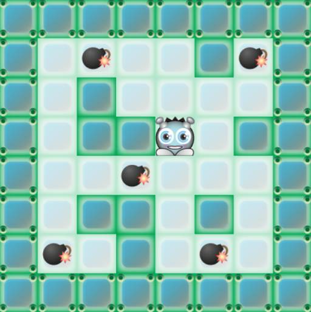
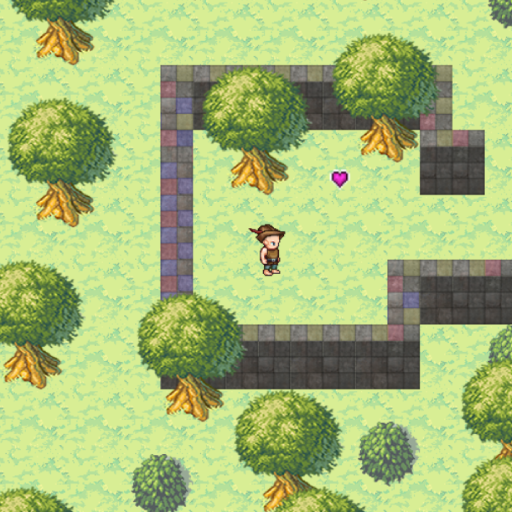
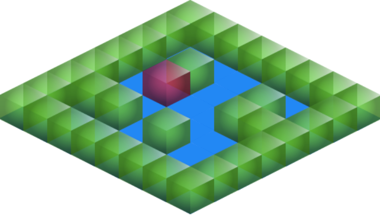
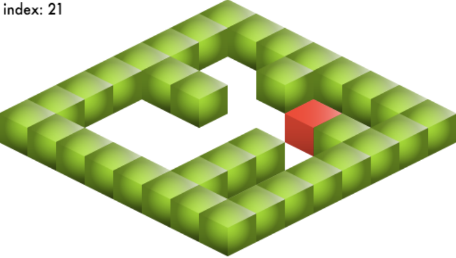
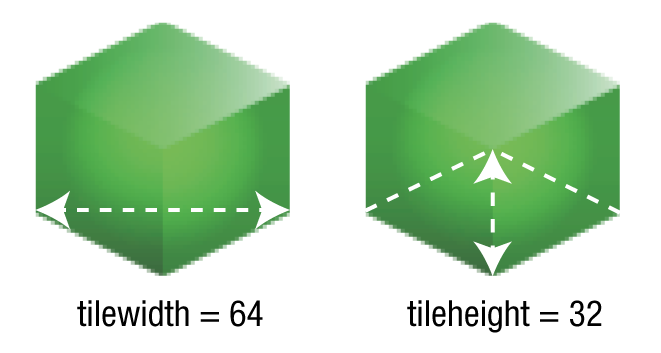
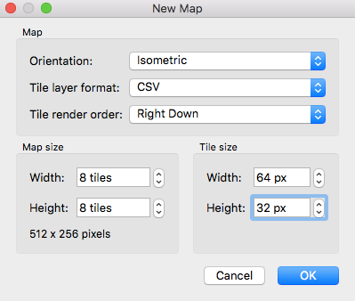
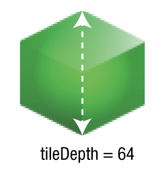
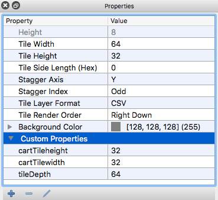
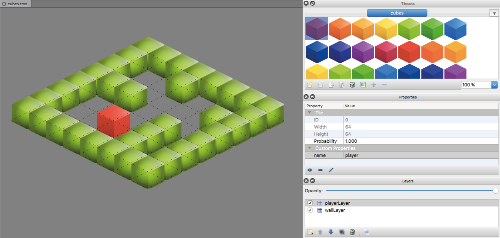

Tile Utilities
=============
Tile Utilities is a collection of helpful methods and objects for using [Tiled Editor](http://www.mapeditor.org) with the [Pixi renderering engine](https://github.com/pixijs/pixi.js).
`makeTiledWorld` is the most important method, so read the documentation
ahead to find out how it works, and then read about how you can use
the other methods for supplementary features.

Yes, Tile Utilities also contains a full suite of tools for working with isometric maps! That means: isometric collision detection, mouse/touch pointer selection of isometric tiles, and importing of isometric maps created in Tiled Editor.

You can find working examples of how all these methods are used by the
[Hexi game engine](https://github.com/kittykatattack/hexi) in the
links below (click
the image links to play the examples and use the arrow keys to
move the game characters):

[](https://gitcdn.xyz/repo/kittykatattack/hexi/master/examples/36_tiledEditorSupport.html)

Here's the [source code](https://github.com/kittykatattack/hexi/blob/master/examples/src/tiledEditorSupport.js).

[](https://gitcdn.xyz/repo/kittykatattack/hexi/master/examples/37_scrollingWorldCamera.html)

Here's the [source code](https://github.com/kittykatattack/hexi/blob/master/examples/src/scrollingWorldCamera.js).

These two examples are the best place to start learning about how to
use the Tile Utilities methods and objects.

But Tile Utilities also works with isometric maps.

[](https://gitcdn.xyz/repo/kittykatattack/hexi/master/examples/42_isometricDepthLayering.html)
    
Here's the [source code](https://github.com/kittykatattack/hexi/blob/master/examples/src/isometricDepthLayering.js).

If you need to implement a scrolling camera to your Tiled game world,
use the `worldCamera` method from the [Game Utilities](https://github.com/kittykatattack/gameUtilities) library.

If you have any questions about how any of these methods work, just ask in this repository's **Issues**.

Table of contents
-----------------

[Setting up and installing Tile Utilities](#settingup).<br>
[makeTiledWorld](#maketiledworld): Create a Pixi game scene from a Tiled Editor JSON data file.<br>
[getObject](#getobject): Access an object from a Tiled Editor map as a Pixi sprite.<br>
[Create sprites from map objects](#createsprites): Use a Tiled Editor object to make a Pixi sprite.<br>
[Layer groups](#layergroups): Access a Tiled Editor layer group.<br>
[GID values](#gidvalues): Accessing and using Tiled Editor GID map array values.<br>
[Using the data array](#dataarray): Accessing and using Tiled Editor `data` array values.<br>
[getObject](#getobjects): Accessing multiple sprites in a Tiled Editor map.<br>
[hitTestTile](#hittesttile): An all-purpose collision method for tile-based games.<br>
[getIndex](#getindex): Convert a sprite's x and y position to a map index value.<br>
[getTile](#gettile): Convert a map index value into a sprite's x and y screen position.<br>
[surroundingCells](#surroundingcells): Find all the map array index numbers surrounding a center index number.<br>
[getPoints](#getpoints): Find all the map array index numbers surrounding a center index number.<br>
[byDepth](#bydepth): And array `sort` function for isometric maps that depth-sorts sprites according to their `z` properties.<br>
[hitTestIsoTile](#hittestisotile): Collision detection for isometric sprites.<br>
[getIsoPoints](#getisopoints): The isometric equivalent of `getPoints`.<br>
[makeIsoPointer](#makeisopointer): Add isometric properties to a mouse/touch pointer so that you can select isometric tiles.<br>
[isoRectangle](#isorectangle): Creates an isometric rectangle that's useful for prototyping isometric maps.<br>
[addIsoProperties](#addIsoPorperties): Adds isometric properties to any sprite to automatically convert between Cartesian and isometric coordinates.<br>
[makeIsoTiledWorld](#makeisotiledworld): Creates an isometric world from a Tiled Editor JSON data file. The isometric verision of `makeTiledWorld.<br>

<a id="settingup"></a>
Setting up
----------

Link the `tileUtilities.js` file from this repository's `bin` folder
to your HTML document with a `<script>` tag. (Or, load it into your JS
file using any module system you prefer.) Next, instantiate
`TileUtilites` in your JS file like this:
```js
let tu = new TileUtilities(PIXI);
```
The constructor requires a reference to the `PIXI` object you have running in your application.
If you don't supply one, `tileUtilites.js` will look for a global `PIXI` object. If it can't find Pixi for
some reason, it will throw you an error to let you know.

You can now access all the `TileUtilities` methods with the `tu` object in
your application.

<a id="maketiledworld"></a>
makeTiledWorld
--------------

`makeTiledWorld` is a quick and easy way to display a game world designed in
Tiled Editor. Supply `makeTiledWorld` with 2 **string file path arguments**: 

1. A JSON file generated by Tiled Editor. **Important:** the **Tile Layer Format** has to be `CSV` format (Comma Seperated Value.) 
2. A source image that represents the tileset you used to create the Tiled Editor world.
```js
let world = tu.makeTiledWorld("tiledEditorMapData.json", "tileset.png");
```
(Note: `makeTiledWorld` looks for the JSON data file in Pixi's `loader.resources` object. So, 
make sure you've loaded the JSON file using Pixi's `loader`.)

`makeTiledWorld` will return a Pixi `Container` that contains all the things in your Tiled Editor
map as Pixi sprites.

All the image tiles you create in Tiled Editor are automatically converted into Pixi sprites
for you by `makeTiledWorld`. You can access all of them using two methods: `getObject` (for
single sprites) and `getObjects` (with an "s") for multiple sprites. Let's find out how they work.

<a id="getobject"></a>
world.getObject
---------------

Tiled Editor lets you assign a "name" property to any object.
You can access any sprite by this `name` using the `getObject` method. `getObject` searches for and
returns a sprite in the `world` that has the same `name` property that you assigned
in Tiled Editor. Here's how to use `getObject` to look for an object called "alien"
in the Tiled map data and assign it to a variable called `alien`
```js  
let alien = world.getObject("alien");  
```
`alien` is now an ordinary Pixi sprite that you can control just like any other Pixi
sprite in your games.

<a id="createsprites"></a>
Creating sprites from generic objects
-------------------------------------

Tiled Editor lets you create generic objects. These are objects that don't have images associated
with them. Generic objects are handy to use, because they let you create complex game objects inside
Tiled Editor, as pure data. You can then use that data your game code to build complex game objects.

For example, imagine that you want to create a complex animated walking sprite called "elf".
First, create the elf object in Tiled Editor as a generic object, but don't assign any image tiles
to it. Next, in your game code, create a new Pixi `MovieClip` called `elf` and give it any textures you want
to use for its animation states.
```js
let elf = new PIXI.extras.MovieClip(elfSpriteTextures);
```
Then use the `x` and `y` data from the generic "elf" object you created in Tiled Editor to position the 
`elf` sprite.
```js
elf.x = world.getObject("elf").x;
elf.y = world.getObject("elf").y;
```
This is a simple example, but you could make very complex data objects in Tiled Editor and 
use them to build complex sprites in the same way.

<a id="layergroups"></a>
Accessing Tiled Editor layer groups 
-----------------------------------

Tiled Editor lets you create **layer groups**. Each layer group you create
in Tiled Editor is automatically converted by `makeTiledWorld` into a Pixi `Container`
object. You can access those containers using `getObject` to extract the layer group
container. 

Here's how you could extract the layer group called "objects" and add the 
`elf` sprite to it.
```js
let objectsLayer = world.getObject("objects");
objectsLayer.addChild(elf);
```
If you want to add the sprite to a different world layer, you can do it like this:
```js
world.getObject("treeTops").addChild(elf);
```
If you want to access all the sprites in a specific Tiled Editor layer, just supply
`getObject` with the name of the layer. For example, if the layer name is "items", you
can access it like this:
```js
let itemsLayer = world.getObject("items");
```
`itemsLayer` is now a Pixi container with a `children` array that contains all the sprites
on that layer.  

To be safe, clone this array to create a new version
that doesn't point to the original data file:
```js
items = itemsLayer.children.slice(0);  
```
You can now manipulate the `items` array freely without worrying about changing
the original array. This can possibly help prevent some weird bugs in a complex game.

<a id="gidvalues"></a>
Finding the "gid" values
------------------------

Tiled Editor uses "gid" numbers to identify different kinds of things in the world.
If you ever need to extract sprites with specific `gid` numbers in a 
layer that contains different kinds of things, you can do it like this:
```js
let items = itemsLayer.children.map(sprite => {
  if (sprite.gid !== 0) return sprite; 
});
```
This example will give you a new array called `items` that contains sprites
that **don't** have `gid` values of 0.

Every sprite created by `makeTiledWorld` has a `gid` property with a value that matches its
Tiled Editor "gid" value.

<a id="dataarray"></a>
Accessing a layer's "data" array
--------------------------------

Tiled Editor's layers have a `data` property
that is an array containing all the grid id numbers (`gid`) of
the tiles in that array. Imagine that you've got a layer full of similar
tiles representing the walls in a game. How do you access the array
containing all the "gid" numbers of the wall sprites in that layer? If the layer's name is called "wallLayer", you 
can access the `wallLayer`'s `data` array of sprites like this: 
```js
wallMapArray = world.getObject("wallLayer").data;
```
`wallMapArray` is now an array of "gid" numbers referring to all the sprites on that
layer. You can now use this data for collision detection, or doing any other kind
of world building.

<a id="getobjects"></a>
world.getObjects
----------------

There's another method called `getObjects` (with an "s"!) that lets you extract
an array of sprites from the Tiled Editor data. Imagine that you created three
game objects in Tiled Editor called "marmot", "skull" and "heart". `makeTiledWorld`
automatically turns them into sprites, and you can access
all of them as an array of sprites using `getObjects` like this:
```js
let gameItemsArray = world.getObjects("marmot", "skull", "heart");
```

<a id="hittesttile"></a>
hitTestTile
-----------

`hitTestTile` checks for a collision between a sprite and a tile in any map array that you
specify. It returns a `collision` object. `collision.hit` is a Boolean 
that tells you if a sprite is colliding with the tile that you're checking.
`collision.index` tells you the map array's index number of the colliding sprite. You can check for
a collision with the tile against "every" corner point on the
sprite, "some" corner points, or the sprite's "center" point.
```js
tu.hitTestTile(sprite, array, collisionGid, world, pointsToCheck);
```
The `world` object (the 4th argument) has to have these properties:
`tileheight`, `tilewidth`, `widthInTiles`. `pointsToCheck` can have
the string value "some", "every" or "center".

Here's how you could use  `hitTestTile` to check for a collision between a sprite
called `alien` and an array of wall sprites with map gid numbers of 0.
```js
let alienVsFloor = tu.hitTestTile(alien, wallMapArray, 0, world, "every");
```
`alienVsFloor` will be object with two properties: `hit` and `index`.
You can use these values to resolve the collision.

For working example of `hitTestTile`, and how to resolve collisions, [see this example](https://github.com/kittykatattack/hexi/blob/master/examples/src/tiledEditorSupport.js) from the [Hexi game engine](https://github.com/kittykatattack/hexi).

<a id="getindex"></a>
getIndex
--------

The `getIndex` helper method converts a sprite's x and y position to an array index number.  
It returns a single index value that tells you the map array index number that the sprite is in.
```js
tu.getIndex(sprite.x, sprite.y, tileWidth, tileHeight, mapWidthInTiles);
```

<a id="gettile"></a>
getTile
-------

The `getTile` helper method converts a tile's index number into x/y screen
coordinates, and captures the tile's grid index (`gid`) number.
It returns an object with `x`, `y`, `centerX`, `centerY`, `width`, `height`, `halfWidth`
`halffHeight` and `gid` properties. (The `gid` number is the value that the tile has in the
`mapArray`) This lets you use the returned object with 2D geometric collision functions like `hitTestRectangle`
or `rectangleCollision` from the [Bump collision library](https://github.com/kittykatattack/bump).

Supply `getTile` with a map array index number, the map array, and the
`world` object that represents your game world.
```js
tu.getTile(index, mapArray, world);
```
The `world` object requires these properties: `x`, `y`, `tilewidth`, `tileheight` and `widthInTiles`

<a id="surroundingcells"></a>
surroundingCells
----------------

The `surroundingCells` helper method returns an array containing 9
index numbers of map array cells around any given index number.
Use it for an efficient broadphase/narrowphase collision test.
The 2 arguments are the index number that represents the center cell,
and the width of the map array.
```js
let cells = tu.surroundingCells(index, widthInTiles);
```

<a id="getpoints"></a>
getPoints
---------
  
The `getPoints` method takes a sprite and returns
an object that tells you what all its corner points are. The return
object has four properties, each of which is an object with `x` and `y` properties:

- `topLeft`: `x` and `y` properties describing the top left corner point.
- `topRight`: `x` and `y` properties describing the top right corner point.
- `bottomLeft`: `x` and `y` properties describing the bottom left corner point.
- `bottomRight`: `x` and `y` properties describing the bottom right corner point.

If the sprite has a `collisionArea` property that defines a
smaller rectangular area inside the sprite, that collision
area can be used for collisions instead of the sprite's dimensions. Here's
how you could define a `collsionArea` on a sprite called `elf`:
```js
elf.collisionArea = {x: 22, y: 44, width: 20, height: 20};
```
Here's how you could use the `getPoints` method to find all the collision area's corner points.
```js
let cornerPoints = tu.getPoints(elf.collisionArea);
```

<a id="bydepth"></a>
byDepth
-------

If your sprites in an isometric map have `z` properties that define their depth layers, you can depth-sort them using the array `byDepth` method like this:
```js
world.children.sort(tu.byDepth);
```

<a id="hittestisotile"></a>
hitTestIsoTile
--------------

Same API as `hitTestTile`, except that it works with isometric sprites.
Make sure that your `world` object has properties called
`cartTileWidth` and `cartTileHeight` that define the Cartesian width and 
height of your tile cells, in pixels.

<a id="getisopoints"></a>
getIsoPoints
--------------

Get all the map index numbers surrounding an isometric map cell. The isometric equivalent to `getPoints`

<a id="makeisopointer"></a>
makeIsoPointer
--------------
Used to add a isometric properties to any mouse/touch `pointer` object with 
`x` and `y` properties. Supply `makeIsoPointer` with the pointer object and
the isometric `world` object. As long as your `pointer` object has `x` and `y` position values, it should work.
```js
tu.makeIsoPointer(pointer, world);
```
It adds the following properties to the `pointer` object:
```js
pointer.cartX    //The Cartesian x position on the isometric map
pointer.cartY    //The Cartesian y position on the isometric map
pointer.column   //The isometric column over which the pointer is touching
pointer.row      //The isometric row over which the pointer is touching
pointer.index    //The map array index value of the current isometric tile
```

<a id="isorectangle"></a>
isoRectangle
--------------

Creates an isometric rectangle (squashed diamond shape) that's useful for prototyping isometric maps. Its first two arguments are the Cartesian width and height of your map's tile cells, and the third is the color. For example:
```js
sprite = tu.isoRectangle(world.cartTilewidth, world.cartTileheight, 0xCCCCFF);
```

<a id="addisoproperties"></a>
addIsoProperties
--------------

 Adds isometric properties to any sprite:
```
tu.addIsoProperties(anySprite);
```
The sprite now has these properties: `cartX`, `cartY`, `isoX`, `isoY`, `cartWidth`, `cartHeight`.

<a id="makeisotiledworld"></a>
makeIsoTiledWorld
-----------------
Creates an isometric world using Tiled Editor JSON map data. 

[](https://gitcdn.xyz/repo/kittykatattack/hexi/master/examples/43_isometricTiledEditorSupport.html)

Here's the [source code](https://github.com/kittykatattack/hexi/blob/master/examples/src/isometricTiledEditorSupport.js).

`makeIsoTiledWorld` uses the same API as its Cartesian equivalent `makeTiledWorld` method. However, you need to make sure you set Tile Editor up correctly and add some custom map properties to make it work. Let's find out how.

###Configuring and building the map
Before you start creating your Tiled Editor map, prepare a sprite sheet with the isometric tiles that you want to use. And, very importantly, note down the isometric dimensions of sprites. Here are the pixel dimensions you need to know:
•   `tilewidth`: The width of the sprite, from its left to right edge.
•   `tileheight`: The height of the tileheighte’s base area. This is just the height of the squashed diamond shape which defines the base on which the isometric sprite is standing. Usually its half the `tilewidth` value.



These properties are the property names that are used by Tiled Editor, and you’ll be able to access them in the JSON data file that Tiled Editor generates.

You can now use the values to create a new isometric map in Tiled Editor. Open Tiled Editor and select File ~TRA New from the main menu. In the New Map dialog box, select isometric as the Orientation, and use the tilewidth and tileheight values I described above for the Width and Height. 



But we’re not done yet! There are three more values we need to figure out:

•   tileDepth: The total height of the isometric sprite, in pixels. 
•   cartWidth: The Cartesian width of each tile grid cell, in pixels.
•   cartHeight: The Cartesian height of each tile grid cell, in pixels.



You need to add these values as custom properties in Tiled Editor’s Map Properties panel.



When Tiled Editor generates the JSON map data, you'll be able to access these values in the `properties` field.
```
"properties":
    {
     "cartTileheight":"32",
     "cartTilewidth":"32",
     "tileDepth":"64"
    },
```
Now that you’ve got the Map Properties all set up, use your isometric tileset to build your world. Here's an example of what your Tiled Editor workspace might look like.



You can see in the image above that I’ve given the red cube a custom `name` property with the value `“player”`. I’ve also built the map using two layers: the `playerLayer` just contains the red cube, and the  `wallLayer` contains all the maze walls.
When you're finished designing your map, export it as a JSON file, and you’re now ready to use it to start coding a game. Here's how to use `makeIsoTiledWorld` from the JSON map data and isometric `cubes.png` tileset. 
```
world = tu.makeIsoTiledWorld(
  "images/cubes.json",
  "images/cubes.png"
);
```


